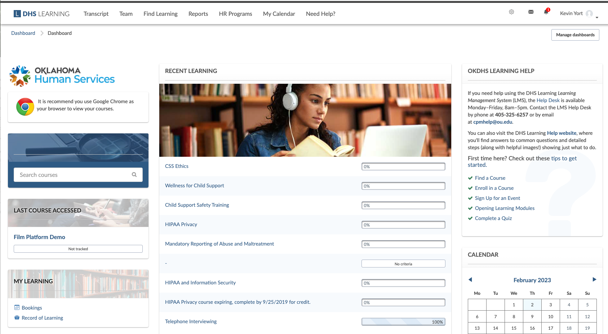
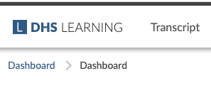
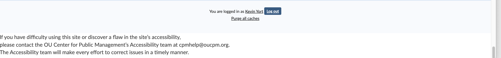

# Totara Theme UI Inventory

## Login Panel
  
The login panel contains:
- The DHS Logo
- The DHS Learing Logo
- Form elements
    1. Label
    2. Input
    3. Checkbox
    4. Button
        1. Disabled state
        2. Active state
        3. Hover state
        4. Focus state

## Dashboard
### Page Header
 
The dashboard is the main interface for users. It is possible to have multiple dashboards assigned to different types of users. However, all dashboards will have some common elements.
#### Main menu
The Main menu is the ribbon across the top of the dashboard. 
1. DHS Learning logo  This logo text is identical to the DHS Learning text on the login screen. However, it is paired with a svg. Just pointing out the inconsistancy. The DHS Learning logo is used as a link. Therefor, it needs an active state and a hover/focus state.
2. Menu items (Transcript, Team, Find Learning, Reports, HR Programs, My Calendar, Need Help?)   These elements can have submenus attached. None of them do in our current implementation. They function as links and so need two states, active and hover/focus.
3. Gear menu (Admin Settings)  
    1. The button for the gear menu has three states
        1. active - normally shown
        2. hover/focus - shown when the user hovers the cursor over it or when a user tabs to the button
        3. pressed - shown when the expanded menu is open
    2. The expanded menu has a search window
    3. The elements in the expanded menu are links and so have two states, active and hover/focus. That includes the elements below the horizontal rule.
4. Messages button  
    1. The button for the messages panel has three states
        1. active - normally shown
        2. hover/focus - shown when the user hovers the coursor over it or when a user tabs to the button
        3. pressed - shown when the expanded panel is open
    2. The expanded Messages panel has a title "Messages"
    3. The elements on the top segment, "New message", the check mark, and the gear icon, are all functionally links and so have two states
        1. active - normally shown
        2. hover/focus - shown when the user hovers the cursor over it or when a user tabs to the button
    4. The Message element is also functionally a link
        1. active state
        2. hover/focus state
    5. The footer of the panel contains one link, the See all link.
5. Notifications button I didn't include an image of the notifications panel expanded because it is very similar to the messages panel. 
    1. The button for the notification panel has three states
        1. active - normally shown
        2. hover/focus - shown when the user hovers the coursor over it or when a user tabs to the button
        3. pressed - shown when the expanded panel is open
    2. The expanded notification panel has a title "Notifications"
    3. The elements on the top segment,  the check mark and the gear icon, are functionally links and so have two states
        1. active - normally shown
        2. hover/focus - shown when the user hovers the cursor over it or when a user tabs to the button
    4. The notification element is also functionally a link
        1. active state
        2. hover/focus state
    5. The footer of the panel contains one link, the See all link. 
6. User menu  
    1. The user menu button contains three elements
        1. User name
        2. User image (optional)
        3. Action indicator
    2. It behaves as a button so should have three states
        1. Active
        2. Hover/focus
        3. Pressed
    3. Each item on the user menu contains two elements
        1. icon
        2. option title
    4. Each item behaves as a link so should have two states
        1. active
        2. hover/focus
7. Breadcrumb  The breadcrumb is made up of three elements:
    1. Higher level of path. This is a link so has two states.
        1. active
        2. hover/focus
    2. Divider. In the previous theme this is a greater than symbol. It is used to separate the various files of the path.
    3. Current page. This element is just text as it would only link to the page the user is already on.
### Content Area
1. Small blocks
    1. Common styles
        1. Header
            1. Font, Size, Weight
            2. Title position
        2. Body 
            1. Spacing
            2. Font, Size, Weight
    2. Custom styles
        1. Header
            1. Background Image
            2. Title 
                1. font
                2. position
        2. Body
2. Large Blocks  
    1. Common styles
        1. Header
            1. Font, Size, Weight
            2. Title position
        2. Body 
            1. Spacing
            2. Font, Size, Weight
    2. Custom styles
        1. Header
            1. Background Image
            2. Title 
                1. font
                2. position
        2. Body

### Footer

- background
- Log out button
- links
- accessibility message

## Reports Screen
### Page Header
#### Main menu
The Main menu is the ribbon across the top of the dashboard.
1. DHS Learning logo  This logo text is identical to the DHS Learning text on the login screen. However, it is paired with a svg. Just pointing out the inconsistancy. The DHS Learning logo is used as a link. Therefor, it needs an active state and a hover/focus state.
2. Menu items (Transcript, Team, Find Learning, Reports, HR Programs, My Calendar, Need Help?)   These elements can have submenus attached. None of them do in our current implementation. They function as links and so need two states, active and hover/focus.
3. Gear menu (Admin Settings)
    1. The button for the gear menu has three states
        1. active - normally shown
        2. hover/focus - shown when the user hovers the cursor over it or when a user tabs to the button
        3. pressed - shown when the expanded menu is open
    2. The expanded menu has a search window
    3. The elements in the expanded menu are links and so have two states, active and hover/focus. That includes the elements below the horizontal rule.
4. Messages button
    1. The button for the messages panel has three states
        1. active - normally shown
        2. hover/focus - shown when the user hovers the coursor over it or when a user tabs to the button
        3. pressed - shown when the expanded panel is open
    2. The expanded Messages panel has a title "Messages"
    3. The elements on the top segment, "New message", the check mark, and the gear icon, are all functionally links and so have two states
        1. active - normally shown
        2. hover/focus - shown when the user hovers the cursor over it or when a user tabs to the button
    4. The Message element is also functionally a link
        1. active state
        2. hover/focus state
    5. The footer of the panel contains one link, the See all link.
5. Notifications button I didn't include an image of the notifications panel expanded because it is very similar to the messages panel. 
    1. The button for the notification panel has three states
        1. active - normally shown
        2. hover/focus - shown when the user hovers the coursor over it or when a user tabs to the button
        3. pressed - shown when the expanded panel is open
    2. The expanded notification panel has a title "Notifications"
    3. The elements on the top segment,  the check mark and the gear icon, are functionally links and so have two states
        1. active - normally shown
        2. hover/focus - shown when the user hovers the cursor over it or when a user tabs to the button
    4. The notification element is also functionally a link
        1. active state
        2. hover/focus state
    5. The footer of the panel contains one link, the See all link.
6. User menu
    1. The user menu button contains three elements
        1. User name
        2. User image (optional)
        3. Action indicator
    2. It behaves as a button so should have three states
        1. Active
        2. Hover/focus
        3. Pressed
    3. Each item on the user menu contains two elements
        1. icon
        2. option title
    4. Each item behaves as a link so should have two states
        1. active
        2. hover/focus
7. Breadcrumb The breadcrumb is made up of three elements:
    1. Higher level of path. This is a link so has two states.
        1. active
        2. hover/focus
    2. Divider. In the previous theme this is a greater than symbol. It is used to separate the various files of the path.
    3. Current page. This element is just text as it would only link to the page the user is already on.
### Content Area
#### Report Area

- Header
    1. Section title
    2. Create report button (functions as a link so two states, Active and Focus/Hover)
- Display  
    Each report represented by an object on screen. Must display required elemets:
    1. Report title 
     
#### Scheduled Reports Area

- Header
    1. Section title
- Display
    1. Scheduled Report list
    2. Add a scheduled report section
        1. label
        2. select box for reports
        3. Submit button (functions as a link so two states, Active and Focus/Hover)
### Footer

## Find Learning Screen

### Page Header
#### Main menu
The Main menu is the ribbon across the top of the dashboard.
1. DHS Learning logo  This logo text is identical to the DHS Learning text on the login screen. However, it is paired with a svg. Just pointing out the inconsistancy. The DHS Learning logo is used as a link. Therefor, it needs an active state and a hover/focus state.
2. Menu items (Transcript, Team, Find Learning, Reports, HR Programs, My Calendar, Need Help?)   These elements can have submenus attached. None of them do in our current implementation. They function as links and so need two states, active and hover/focus.
3. Gear menu (Admin Settings)
    1. The button for the gear menu has three states
        1. active - normally shown
        2. hover/focus - shown when the user hovers the cursor over it or when a user tabs to the button
        3. pressed - shown when the expanded menu is open
    2. The expanded menu has a search window
    3. The elements in the expanded menu are links and so have two states, active and hover/focus. That includes the elements below the horizontal rule.
4. Messages button
    1. The button for the messages panel has three states
        1. active - normally shown
        2. hover/focus - shown when the user hovers the coursor over it or when a user tabs to the button
        3. pressed - shown when the expanded panel is open
    2. The expanded Messages panel has a title "Messages"
    3. The elements on the top segment, "New message", the check mark, and the gear icon, are all functionally links and so have two states
        1. active - normally shown
        2. hover/focus - shown when the user hovers the cursor over it or when a user tabs to the button
    4. The Message element is also functionally a link
        1. active state
        2. hover/focus state
    5. The footer of the panel contains one link, the See all link.
5. Notifications button I didn't include an image of the notifications panel expanded because it is very similar to the messages panel. 
    1. The button for the notification panel has three states
        1. active - normally shown
        2. hover/focus - shown when the user hovers the coursor over it or when a user tabs to the button
        3. pressed - shown when the expanded panel is open
    2. The expanded notification panel has a title "Notifications"
    3. The elements on the top segment,  the check mark and the gear icon, are functionally links and so have two states
        1. active - normally shown
        2. hover/focus - shown when the user hovers the cursor over it or when a user tabs to the button
    4. The notification element is also functionally a link
        1. active state
        2. hover/focus state
    5. The footer of the panel contains one link, the See all link.
6. User menu
    1. The user menu button contains three elements
        1. User name
        2. User image (optional)
        3. Action indicator
    2. It behaves as a button so should have three states
        1. Active
        2. Hover/focus
        3. Pressed
    3. Each item on the user menu contains two elements
        1. icon
        2. option title
    4. Each item behaves as a link so should have two states
        1. active
        2. hover/focus
7. Breadcrumb The breadcrumb is made up of three elements:
    1. Higher level of path. This is a link so has two states.
        1. active
        2. hover/focus
    2. Divider. In the previous theme this is a greater than symbol. It is used to separate the various files of the path.
    3. Current page. This element is just text as it would only link to the page the user is already on.
### Content Area
#### Find learning section
- Header
    1. Section title
    2. Admin buttons (function as a links so two states, Active and Focus/Hover)
        1. Customize this page
        2. Configure catalog
        3. Create course
- Display
    1. Filter  
        1.  Dropdown
            1. Box outline
            2. arrow button (has two states, Active and Focus/Hover)
            3. list item
                1. selected state
                2. available state
        2. Search
            1. Text input
            2. Search button (functions as a link so two states, Active and Hover/Focus)
    2. Overview
        1. Course count
        2. Share button (functions as a button so three states, Active, Focus/Hover, and Pressed)
               
            1. Header
                1. Title
                2. close button (functions as a link so two states, Active and Focus/Hover)
            2. Body
                1. Text
                2. Text input
                3. Copy link button (functions as a button so three states, Active, Focus/Hover, and Pressed)
        3. Sort by
            1. label
            2. Dropdown  
                1. Box outline
                2. arrow button (has two states, Active and Focus/Hover)
                3. list item
                    1. selected state
                    2. available state
    3. Course list
        1. Grid
            1. set width
            2. image display
            3. course title
            4. course credit hours
        2. List
            1. full width
            2. image display
            3. course title
            4. course credit hours
    4. Load more button (functions as a link so two states, Active and Focus/Hover)
### Footer

## Admin Screen

### Page Header
#### Main menu
The Main menu is the ribbon across the top of the dashboard.
1. DHS Learning logo  This logo text is identical to the DHS Learning text on the login screen. However, it is paired with a svg. Just pointing out the inconsistancy. The DHS Learning logo is used as a link. Therefor, it needs an active state and a hover/focus state.
2. Menu items (Transcript, Team, Find Learning, Reports, HR Programs, My Calendar, Need Help?)   These elements can have submenus attached. None of them do in our current implementation. They function as links and so need two states, active and hover/focus.
3. Gear menu (Admin Settings)
    1. The button for the gear menu has three states
        1. active - normally shown
        2. hover/focus - shown when the user hovers the cursor over it or when a user tabs to the button
        3. pressed - shown when the expanded menu is open
    2. The expanded menu has a search window
    3. The elements in the expanded menu are links and so have two states, active and hover/focus. That includes the elements below the horizontal rule.
4. Messages button
    1. The button for the messages panel has three states
        1. active - normally shown
        2. hover/focus - shown when the user hovers the coursor over it or when a user tabs to the button
        3. pressed - shown when the expanded panel is open
    2. The expanded Messages panel has a title "Messages"
    3. The elements on the top segment, "New message", the check mark, and the gear icon, are all functionally links and so have two states
        1. active - normally shown
        2. hover/focus - shown when the user hovers the cursor over it or when a user tabs to the button
    4. The Message element is also functionally a link
        1. active state
        2. hover/focus state
    5. The footer of the panel contains one link, the See all link.
5. Notifications button I didn't include an image of the notifications panel expanded because it is very similar to the messages panel. 
    1. The button for the notification panel has three states
        1. active - normally shown
        2. hover/focus - shown when the user hovers the coursor over it or when a user tabs to the button
        3. pressed - shown when the expanded panel is open
    2. The expanded notification panel has a title "Notifications"
    3. The elements on the top segment,  the check mark and the gear icon, are functionally links and so have two states
        1. active - normally shown
        2. hover/focus - shown when the user hovers the cursor over it or when a user tabs to the button
    4. The notification element is also functionally a link
        1. active state
        2. hover/focus state
    5. The footer of the panel contains one link, the See all link.
6. User menu
    1. The user menu button contains three elements
        1. User name
        2. User image (optional)
        3. Action indicator
    2. It behaves as a button so should have three states
        1. Active
        2. Hover/focus
        3. Pressed
    3. Each item on the user menu contains two elements
        1. icon
        2. option title
    4. Each item behaves as a link so should have two states
        1. active
        2. hover/focus
7. Breadcrumb The breadcrumb is made up of three elements:
    1. Higher level of path. This is a link so has two states.
        1. active
        2. hover/focus
    2. Divider. In the previous theme this is a greater than symbol. It is used to separate the various files of the path.
    3. Current page. This element is just text as it would only link to the page the user is already on.
### Content Area
1. Breadcrumb  The breadcrumb is made up of three elements:
    1. Higher level of path. This is a link so has two states.
        1. active
        2. hover/focus
    2. Divider. In the previous theme this is a greater than symbol. It is used to separate the various files of the path.
    3. Current page. This element is just text as it would only link to the page the user is already on.
#### Sidebar
- Small blocks
    1. Common styles
        1. Header
            1. Font, Size, Weight
            2. Title position
        2. Body 
            1. Spacing
            2. Font, Size, Weight
    2. Custom styles
        1. Header
            1. Background Image
            2. Title 
                1. font
                2. position
        2. Body
#### Settings Controls
1. Title
2. List of settings
    1. label
        1. setting name
        2. setting shortname
    2. Form element (the form elements are largely unstyled in the current theme)
        1. box outline
        2. arrow button (has two states, Active and Focus/Hover)
        3. list item
            1. selected state
            2. available state
    3. Default value
    4. Setting description
### Footer

## User screen

### Page Header
#### Main menu
The Main menu is the ribbon across the top of the dashboard.
1. DHS Learning logo  This logo text is identical to the DHS Learning text on the login screen. However, it is paired with a svg. Just pointing out the inconsistancy. The DHS Learning logo is used as a link. Therefor, it needs an active state and a hover/focus state.
2. Menu items (Transcript, Team, Find Learning, Reports, HR Programs, My Calendar, Need Help?)   These elements can have submenus attached. None of them do in our current implementation. They function as links and so need two states, active and hover/focus.
3. Gear menu (Admin Settings)
    1. The button for the gear menu has three states
        1. active - normally shown
        2. hover/focus - shown when the user hovers the cursor over it or when a user tabs to the button
        3. pressed - shown when the expanded menu is open
    2. The expanded menu has a search window
    3. The elements in the expanded menu are links and so have two states, active and hover/focus. That includes the elements below the horizontal rule.
4. Messages button
    1. The button for the messages panel has three states
        1. active - normally shown
        2. hover/focus - shown when the user hovers the coursor over it or when a user tabs to the button
        3. pressed - shown when the expanded panel is open
    2. The expanded Messages panel has a title "Messages"
    3. The elements on the top segment, "New message", the check mark, and the gear icon, are all functionally links and so have two states
        1. active - normally shown
        2. hover/focus - shown when the user hovers the cursor over it or when a user tabs to the button
    4. The Message element is also functionally a link
        1. active state
        2. hover/focus state
    5. The footer of the panel contains one link, the See all link.
5. Notifications button I didn't include an image of the notifications panel expanded because it is very similar to the messages panel. 
    1. The button for the notification panel has three states
        1. active - normally shown
        2. hover/focus - shown when the user hovers the coursor over it or when a user tabs to the button
        3. pressed - shown when the expanded panel is open
    2. The expanded notification panel has a title "Notifications"
    3. The elements on the top segment,  the check mark and the gear icon, are functionally links and so have two states
        1. active - normally shown
        2. hover/focus - shown when the user hovers the cursor over it or when a user tabs to the button
    4. The notification element is also functionally a link
        1. active state
        2. hover/focus state
    5. The footer of the panel contains one link, the See all link.
6. User menu
    1. The user menu button contains three elements
        1. User name
        2. User image (optional)
        3. Action indicator
    2. It behaves as a button so should have three states
        1. Active
        2. Hover/focus
        3. Pressed
    3. Each item on the user menu contains two elements
        1. icon
        2. option title
    4. Each item behaves as a link so should have two states
        1. active
        2. hover/focus
7. Breadcrumb The breadcrumb is made up of three elements:
    1. Higher level of path. This is a link so has two states.
        1. active
        2. hover/focus
    2. Divider. In the previous theme this is a greater than symbol. It is used to separate the various files of the path.
    3. Current page. This element is just text as it would only link to the page the user is already on.
### Content Area
#### Sidebar
- Small blocks
    1. Common styles
        1. Header
            1. Font, Size, Weight
            2. Title position
        2. Body 
            1. Spacing
            2. Font, Size, Weight
    2. Custom styles
        1. Header
            1. Background Image
            2. Title 
                1. font
                2. position
        2. Body
#### Main Content
1. Title
    1. page title
    2. record count (Dynamic data)
2. Search
    1. Search By   
    
        1. down arrow button (functions as a button so three states, Active, Hover/Focus, and Pressed)
        2. Search by element
            1. label
            2. help button
            3. form elements
                1. match criteria
                2. match value
            4. Show link (functions as a link so two states, Active and Hover/Focus)
        3. Create user area
            1. Create user button (functions as a link so two states, Active and Hover/Focus)
            2. label
            3. input field  
            4. buttons (function as a links so two states, Active and Hover/Focus)
                1. Search
                2. Clear
    2. User table
        1. Pagination
            1. Page label
            2. Previous and Next links (function as links so two states, Active and Hover/Focus)
            3. Page buttons (functions a link so two states, Active and Hover/Focus)
        2. Table
            1. Headers
                1. Sortable headers (links so two states, Active and Hover/Focus)
                2. Non-sortable headers (text)
            2. Item rows   
                1. user image thumbnail
                2. links (two states, Active and Hover/Focus)
                    1. Full name
                    2. email
                3. Text
                4. Action buttons
                    1. Edit
                    2. Manage login
                    3. User data
                    4. Delete user 
    3. Export section
        1. Create user button (functions as a link so two states, Active and Hover/Focus)
        2. label
        3. Format dropdown
        4. Export button (functions as a button so three states, Active, Hover/Focus, and Pressed)
### Footer

## System Information 

### Page Header
#### Main menu
The Main menu is the ribbon across the top of the dashboard. 
1. DHS Learning logo  This logo text is identical to the DHS Learning text on the login screen. However, it is paired with a svg. Just pointing out the inconsistancy. The DHS Learning logo is used as a link. Therefor, it needs an active state and a hover/focus state.
2. Menu items (Transcript, Team, Find Learning, Reports, HR Programs, My Calendar, Need Help?)   These elements can have submenus attached. None of them do in our current implementation. They function as links and so need two states, active and hover/focus.
3. Gear menu (Admin Settings)
    1. The button for the gear menu has three states
        1. active - normally shown
        2. hover/focus - shown when the user hovers the cursor over it or when a user tabs to the button
        3. pressed - shown when the expanded menu is open
    2. The expanded menu has a search window
    3. The elements in the expanded menu are links and so have two states, active and hover/focus. That includes the elements below the horizontal rule.
4. Messages button
    1. The button for the messages panel has three states
        1. active - normally shown
        2. hover/focus - shown when the user hovers the coursor over it or when a user tabs to the button
        3. pressed - shown when the expanded panel is open
    2. The expanded Messages panel has a title "Messages"
    3. The elements on the top segment, "New message", the check mark, and the gear icon, are all functionally links and so have two states
        1. active - normally shown
        2. hover/focus - shown when the user hovers the cursor over it or when a user tabs to the button
    4. The Message element is also functionally a link
        1. active state
        2. hover/focus state
    5. The footer of the panel contains one link, the See all link.
5. Notifications button I didn't include an image of the notifications panel expanded because it is very similar to the messages panel. 
    1. The button for the notification panel has three states
        1. active - normally shown
        2. hover/focus - shown when the user hovers the coursor over it or when a user tabs to the button
        3. pressed - shown when the expanded panel is open
    2. The expanded notification panel has a title "Notifications"
    3. The elements on the top segment,  the check mark and the gear icon, are functionally links and so have two states
        1. active - normally shown
        2. hover/focus - shown when the user hovers the cursor over it or when a user tabs to the button
    4. The notification element is also functionally a link
        1. active state
        2. hover/focus state
    5. The footer of the panel contains one link, the See all link. 
6. User menu
    1. The user menu button contains three elements
        1. User name
        2. User image (optional)
        3. Action indicator
    2. It behaves as a button so should have three states
        1. Active
        2. Hover/focus
        3. Pressed
    3. Each item on the user menu contains two elements
        1. icon
        2. option title
    4. Each item behaves as a link so should have two states
        1. active
        2. hover/focus
7. Breadcrumb The breadcrumb is made up of three elements:
    1. Higher level of path. This is a link so has two states.
        1. active
        2. hover/focus
    2. Divider. In the previous theme this is a greater than symbol. It is used to separate the various files of the path.
    3. Current page. This element is just text as it would only link to the page the user is already on.
### Content Area
#### Sidebar
- Small blocks
    1. Common styles
        1. Header
            1. Font, Size, Weight
            2. Title position
        2. Body 
            1. Spacing
            2. Font, Size, Weight
    2. Custom styles
        1. Header
            1. Background Image
            2. Title 
                1. font
                2. position
        2. Body
#### Main Content
1. Notifications  
    
    1. icon
    2. text
    3. background
    4. types
        1. Information
        2. Success
        3. Danger
        4. Warning
2. body
### Footer

